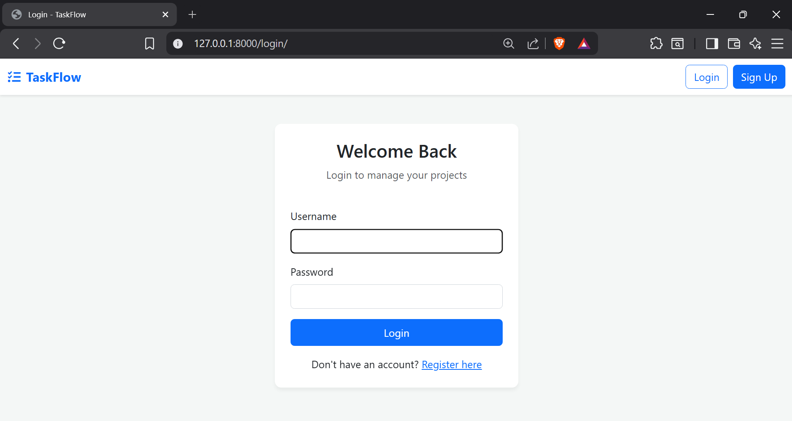
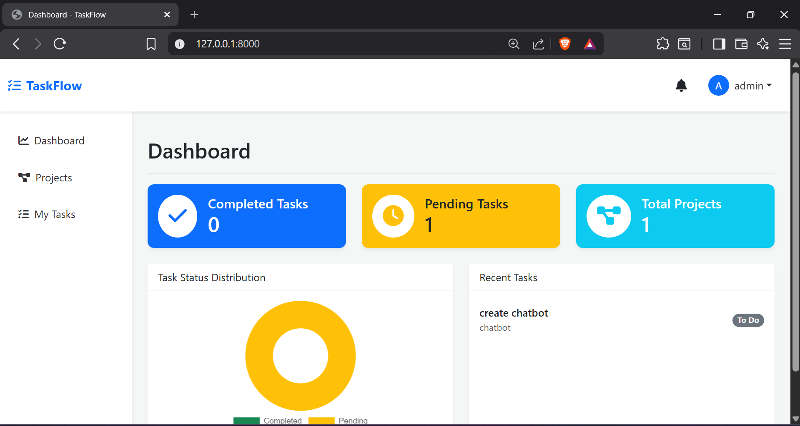

🚀 TaskFlow – Team Project Management Web App

TaskFlow is a full-stack team collaboration and project management system built using Django, inspired by tools like Jira.
It enables teams to manage projects, track tasks visually using a Kanban board, and receive real-time notifications for better coordination.

🧩 Features
🔐 User Authentication & Role-Based Access

Secure user registration and login

Role-Based Access Control (RBAC):

Admin / Manager: Create projects, assign tasks

Member: View projects and update task statuses

📁 Project & Task Management

Centralized project dashboard

Kanban-style task boards:

To Do

In Progress

Done

Task assignment with due dates

🔔 Real-Time Notifications

Instant alerts using WebSockets (Django Channels)

Users receive notifications when:

Tasks are assigned

Task status changes

Notification center in the navigation bar

📊 Dashboard & Analytics

Interactive Doughnut Chart (Chart.js) showing:

Completed vs Pending tasks

Quick metric cards:

Total projects

Pending tasks

🛠 Tech Stack
Layer	Technologies
Backend	Python, Django
Database	PostgreSQL
Real-Time	Django Channels, ASGI (Daphne)
Frontend	HTML, CSS, JavaScript
UI	Bootstrap 5
Analytics	Chart.js
🏗 System Architecture
Client (Browser)
   ↓
Django Views / Templates
   ↓
Django ORM
   ↓
PostgreSQL

WebSocket (Django Channels)
   ↓
Real-Time Notifications

📂 Project Structure
taskflow/
├── accounts/        # Authentication & roles
├── projects/        # Project management
├── tasks/           # Task CRUD & Kanban logic
├── notifications/   # WebSocket notifications
├── templates/       # HTML templates
├── static/          # CSS & JS
├── manage.py

⚙️ Installation & Setup
1️⃣ Clone the Repository
git clone https://github.com/your-username/taskflow.git
cd taskflow

2️⃣ Create Virtual Environment
python -m venv venv
source venv/bin/activate   # Linux / Mac
venv\Scripts\activate      # Windows

3️⃣ Install Dependencies
pip install -r requirements.txt

4️⃣ Configure Database

Update settings.py with PostgreSQL credentials.

DATABASES = {
    'default': {
        'ENGINE': 'django.db.backends.postgresql',
        'NAME': 'taskflow_db',
        'USER': 'postgres',
        'PASSWORD': 'password',
        'HOST': 'localhost',
        'PORT': '5432',
    }
}

5️⃣ Run Migrations
python manage.py makemigrations
python manage.py migrate

6️⃣ Start the Server
python manage.py runserver

📌 Future Enhancements

REST APIs using Django REST Framework

JWT authentication

Email notifications

Dockerization

Cloud deployment (AWS / Render)

👨‍💻 Author

Nitesh Kumar Thammu
📧 Email: niteeshkumar613@gmail.com

🔗 GitHub: https://github.com/nitesh-2003

🔗 LinkedIn: https://linkedin.com/in/nitesh-kumar-thammu-936b53246

⭐ Why This Project?

TaskFlow demonstrates real-world backend development skills including authentication, role-based access, real-time communication, database design, and data visualization — making it a strong portfolio project for software engineering roles.

## 📸 Screenshots

### Login Page

### Admin Dashboard

